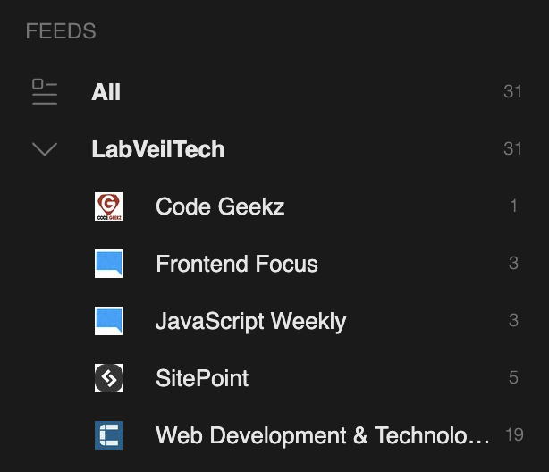

+++
title = "Ma veille"
date = "2024-12-22T19:34:02+00:00"
tags = []
draft = false
author = "Michaël Cheneval"
summary = "Comment j'ai mis ma veille en place"
+++

Pour mettre en place mon système de veille, j'ai tout d'abord cherché sur internet s'il existait un système capable de me centraliser toute l'information que je cherchais. J'ai rapidement trouvé cet outil : feedly.com

La méthode est très simple. Je rentre un mot-clé, comme "Javascript" par exemple. Grâce à ce mot-clé, feedly me cherche automatiquement des sources en lien avec mon intérêt. Je n'ai plus qu'à m'abonner à ces sources, et celles-ci se retrouveront sur mon feed. En m'abonnant à suffisamment de sources, mon feed va se remplir de plusieurs dizaines d'articles et je n'ai qu'à choisir ceux qui m'intéressent pour les intégrer à mon site.

|  |
|:--:|
| *Mes sources pour créer mon feed* |
